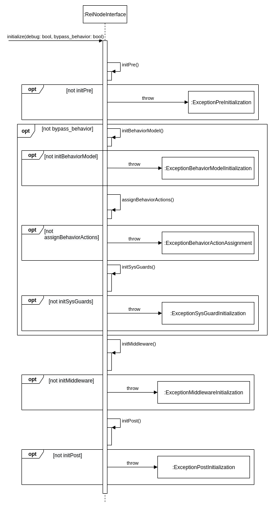

# REI node library design

## Concept
As we are building a highly complex system with reconfigurable behaviors (e.g. through (fuzzy) hybrid automatas or equivalent description formats), some steps are preferrably required, like initialization, processing input behavior specification etc.

Also with our implementation we provide a code generation workflow based on a naive approach to generate ROS/ROS2 interfaces.

## Design
The design (class composition, basic behavior specification) of an abstract node is provided here.

### Initialization
In initialization step (method __initialize__), it can be specified whether to debug (i.e enable addition dataflow) or to bypass underlying behavior (presumably for debugging purposes) dynamically in runtime. The node calls the following abstract methods (which is implemented in the more specific node), each abstract method returning Boolean value indicating the outcome of initialization step:
- __initPre()__: initialization steps before the middleware initialization.
- __initBehaviorModel()__: initialization of the behavior model based on the input specification or in a non-volatile case on a generated specific behavior.
- __assignBehaviorActions()__: assignment of behavior actions related to the underlying behavior.
- __initSysGuards()__: initialization of system and behavior guards.
- __initMiddleware(bool debug, bool enable_behavior)__: initialziation of middleware of choice. Presumably generated based on a network model. Sets the initial initialization of debug dataflow and optionally switch  behavior related dataflow.
- __initPost()__: initialization class after middleware initialization.

#### Exception handling in initialization
The initialization method throws different exceptions during execution, each after abstract method call:
- __initPre()__: throws _ExceptionNodePreInitialization_.
- __initBehaviorModel()__: throws _ExceptionBehaviorInitialization_.
- __assignBehaviorActions()__: throws _ExceptionBehaviorActionAssignment_
- __initSysGuards()__: throws _ExceptionSysGuardInitialization_.
- __initMiddleware(bool debug, bool enable_behavior)__: throws _ExceptionNodeMiddleware_.
- __initPost()__: throws _ExceptionNodePostInitialization_.

